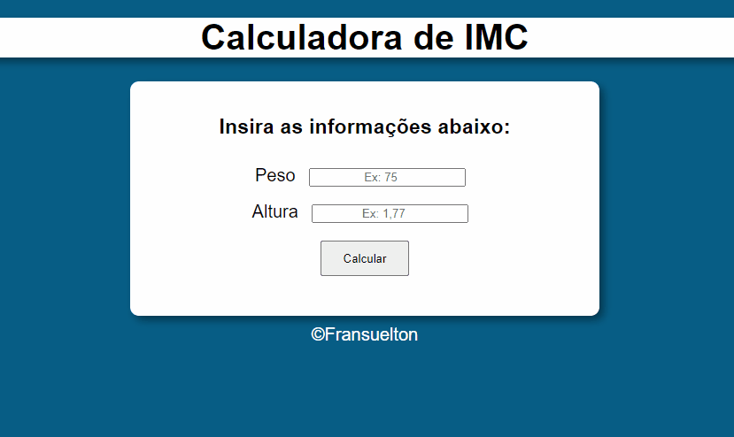

# Projeto Calculadora de IMC
Calculadora de IMC (Índice de Massa Corporal)



## Como utilizar:

1 - Clone o repositório.
```
git clone url-do-repositorio
```
2 - Informe o peso e a altura e clique em calcular.

## Tecnologias utilizadas:
- HTML
- CSS
- JAVASCRIPT

```
write("Obrigado por visitar meu repositório! ❤️")
